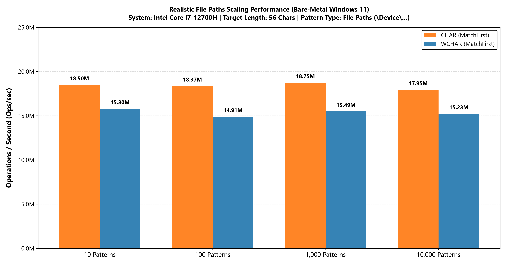
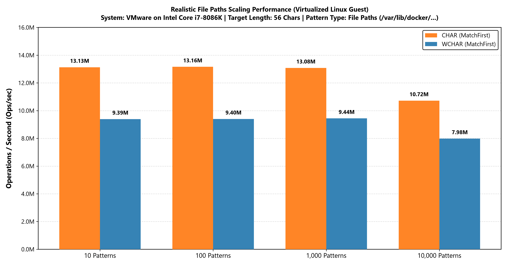
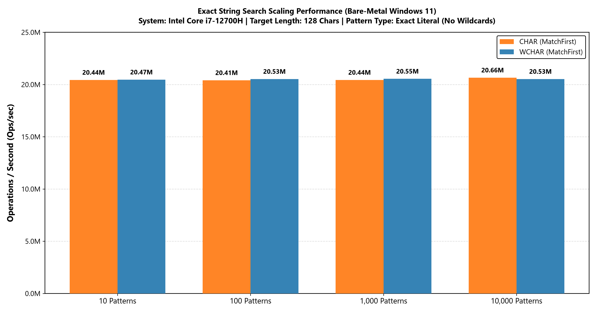
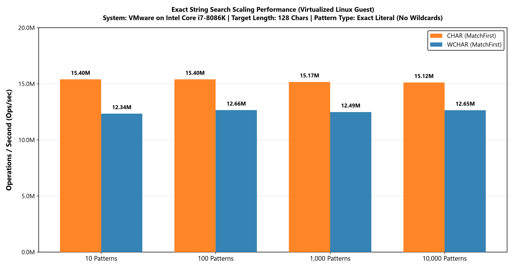

# High-Performance String Pattern Match Engine

-blue)


## Table of Contents
1. [Overview](#overview)
2. [Architecture & Algorithms](#architecture--algorithms)
3. [Quick Start API Overview](#quick-start-api-overview)
   * [Pattern Syntax & Wildcard Scoping](#pattern-syntax--wildcard-scoping)
   * [Template Parameters](#template-parameters)
   * [Public API Methods](#public-api-methods)
   * [Example Implementation](#example-implementation)
4. [Benchmarks & Scaling Performance](#benchmarks--scaling-performance)
   * [Test Methodology & Benchmark Architecture](#test-methodology--benchmark-architecture)
   * [Performance Results](#performance-results)
   * [Toolchain Comparison: GCC vs. Clang (Linux on i7-8086K)](#toolchain-comparison-gcc-vs-clang-linux-on-i7-8086k)
   * [Scaling Analysis](#scaling-analysis)
5. [Project Layout](#project-layout)
6. [Building Test Code](#building-test-code)
   * [Windows (Visual Studio 2026)](#windows-visual-studio-2026)
   * [Linux / macOS (CMake & build.sh)](#linux--macos-cmake--buildsh)
   * [Unicode Case-Folding Test (/unicode_match_sample)](#unicode-case-folding-test-unicode_match_sample)
7. [Conclusion](#conclusion)
8. [License](#license)

---

## Overview

`StringPatternMatch` is a non-blocking, multi-pattern string matching engine designed for high-throughput string filtering, telemetry ingestion, path routing, and rule evaluation in user-space applications. Evaluating candidate strings one pattern at a time via sequential loops or traditional regular expression engines introduces substantial processing latency as rule sets grow. This engine evaluates incoming target strings against a pool of registered patterns simultaneously using prefix grouping, rolling polynomial hashing, a 4096-bit fast-path existence filter, and non-recursive state machines.

To support file system filtering and path routing across platforms, the engine natively implements path segment scoping (`WildcardScope::PathSegment`), which prevents wildcard expansion from crossing operating-system-specific directory separator boundaries (`\` on Windows, `/` on POSIX systems).

### Key Architectural Highlights
* **Multi-Pattern Matching & Early-Exit:** Indexes patterns concurrently across prefix length groups, evaluating target text against the registered rules in a single pass while using multi-level bitmask and hash filters to discard non-matching inputs early.
* **SIMD Hardware Acceleration & Dynamic Dispatch:** Dynamically evaluates CPU capabilities at runtime on x86/x64 systems via CPUID and OSXSAVE to dispatch optimal SIMD backends (AVX-512, AVX2, or SSE4.1). It uses native 128-bit NEON instructions on ARM architectures and provides a portable scalar fallback path.
* **Allocation-Free Matching Path:** Following pattern registration, the engine performs no internal heap allocations during candidate evaluation. (The caller-provided output vector used for multi-match collection may allocate memory as it expands).
* **Lock-Free Read-Copy-Update (RCU) Concurrency:** The engine intentionally avoids internal read/write locks to preserve multi-GB/s SIMD cache throughput. Concurrent updates are achieved via atomic pointer swaps (RCU), ensuring zero contention on the read path.
* **4096-Bit Hash-Existence Filter:** Implements a 4096-bit bitmap existence filter (`m_hashFilter`) alongside prefix length bitmasks to discard non-matching candidates before accessing hash map buckets.
* **64-Bit SWAR Literal Signatures:** Extracts 64-bit SIMD Within A Register (SWAR) prefix signatures and tail anchors for rapid mismatch rejection. Pure ASCII blocks under case-insensitive policies are folded in parallel using bitwise SWAR arithmetic.
* **Non-Recursive State Machine:** Wildcard evaluation relies on an iterative, non-recursive state machine with fast-forward linear scanning, eliminating recursive stack growth and avoiding stack exhaustion on complex or pathological inputs.
* **Policy-Based Normalization:** Decouples casing and validation logic through C++20 concepts, supporting case-sensitive binary matching, 7-bit ASCII case-folding, wide Unicode case-folding, and user-supplied transformation functors.
* **Dual API Interfaces:** Exposes dual interfaces across all registration and query routines, accepting either modern `std::basic_string_view` instances or raw pointer and character-length pairs.

---

## Architecture & Algorithms

This engine is the user-mode version of the Windows kernel string pattern match engine, [KmStringPatternMatch](https://github.com/adanil-code/KmStringPatternMatch). While the kernel-mode implementation is tailored for Windows driver components, file system minifilters, and IRQL constraints using custom kernel containers, this user-mode engine targets cross-platform user-space applications across Windows, Linux, and macOS. It adapts the multi-pattern indexing architecture and non-recursive state machine design to standard C++20 containers and direct SIMD vector instructions without kernel pool or vector-state preservation constraints.

### High-Level Design
The engine uses a two-phase architecture to maximize CPU efficiency during evaluation:
1. **Registration Phase (`AddPattern`):** When a pattern is added, the engine parses it into an exact literal prefix, a wildcard middle segment, and an optional trailing literal anchor. The pattern is validated against the active case policy and stored in stable deque storage. The literal prefix is hashed via the active SIMD or scalar backend, and its hash is stamped into a 4096-bit hash-existence filter. Prefix lengths are tracked in a 256-bit bitmask and a sorted unique length vector. A 64-bit SWAR prefix signature, the minimum required match length, and tail metadata are calculated and stored in a contiguous pattern entry arena. Hash collisions are indexed using intrusive FIFO bucket chains.
2. **Search Phase (`Search`):** Target text is validated against the global minimum registered length. 
   * *Exact-Match Fast Path:* If no wildcards are registered across the entire engine, it executes a direct exact-string check using the prefix length bitmask, a single full-text hash computation, and the hash existence filter, bypassing iterative length loops.
   * *Wildcard Evaluation Path:* If wildcards are present, the engine advances through registered prefix lengths using an incremental rolling polynomial hash. It tests the 4096-bit filter first. On a filter hit, it probes the hash table bucket, validates the 64-bit SWAR signature and precomputed minimum length, checks the anchored literal tail, and verifies the prefix. If the prefix and tail pass, the remaining unparsed text is evaluated by the non-recursive wildcard state machine.

### 1. Container Architecture & Memory Organization
While the kernel implementation uses custom containers (`KStringArena`, `KFlatHashMap`, `KDeque`, `KVector`) to operate without standard runtime support, the user-mode engine utilizes standard C++20 containers structured for cache locality and pointer stability:
* **`std::deque<StringType>` (`m_stringArena`):** Stores registered pattern characters in stable memory slabs, ensuring that `std::basic_string_view` references to literal prefixes and suffixes remain valid without reallocating existing strings during insertions.
* **`std::deque<TContext>` (`m_contextArena`):** Maintains stable storage for caller-supplied payload objects.
* **`std::vector<PatternEntry>` (`m_patternArena`):** Stores 64-byte, cache-aligned metadata records contiguously. Each record packs the 64-bit SWAR signature, prefix/suffix/tail lengths and pointers, collision chain indices, and minimum required lengths into an aligned structure.
* **`std::unordered_map<uint64_t, HashBucket, FastHashKey>` (`m_hashMap`):** Indexes prefix hashes to bucket head and tail indices. The `FastHashKey` functor passes the already-mixed 64-bit polynomial hash directly through as the lookup key to avoid redundant secondary hashing.

### 2. SIMD-Accelerated Rolling Polynomial Hash & Hash-Existence Filter
Unlike kernel environments where executing vector instructions requires saving and restoring extended processor register state (`KeSaveExtendedProcessorState` / `KeRestoreExtendedProcessorState`), user-mode execution can utilize SIMD registers directly without OS save penalties. 

The engine implements a vectorized polynomial rolling hash using a base multiplier of 131:
* **Runtime Dispatch:** During construction, the engine queries CPUID and OSXSAVE feature flags (`_xgetbv`) on x86/x64 to detect AVX-512 (F and BW), AVX2, or SSE4.1 support. On ARM, it targets native 128-bit NEON instructions. An internal dispatch table resolves hash and prefix comparison function pointers without branch overhead in the search loop.
* **Vector Processing:** SIMD backends evaluate 4 (SSE4.1, NEON), 8 (AVX2), or 16 (AVX-512) code units per loop iteration using precomputed polynomial weight vectors.
* **4096-Bit Hash-Existence Filter (`m_hashFilter`):** A 64-word (`uint64_t[64]`) bitmap serves as a high-speed rejection mechanism. Calculated prefix hashes query this bitmap before touching hash map entries, filtering out non-matching target substrings.

### 3. 64-Bit SWAR Signatures & Anchored Tail Filtering
To minimize full string comparison overhead on hash collisions, the engine uses multi-character word comparisons:
* **SWAR Prefix Signatures:** Loads the initial code units of each pattern and candidate text into 64-bit integers. When using ASCII case-folding, it performs a SWAR ASCII check (`IsAsciiSWAR`) and applies parallel bitwise folding (`ToUpperSWAR`) directly within general-purpose registers. Length masking (`MaskSignature`) ensures short prefixes are compared safely without reading out of bounds.
* **Anchored Tail Verification:** Literal characters following the final wildcard operator in a pattern are extracted during registration as a tail anchor. Before invoking the state machine on a candidate, the engine compares the tail anchor against the end of the input string. Targets lacking the required suffix are rejected in $O(1)$ time.
* **Minimum Length Guards:** Each pattern tracks its minimum possible matching length (literal prefix length plus non-`*` suffix characters). Candidates shorter than this length are discarded immediately.

### 4. Non-Recursive Fast-Forward Wildcard State Machine
Traditional wildcard engines often rely on recursive backtracking, risking call-stack exhaustion on complex patterns or large input payloads. 

The engine uses an iterative state machine with fast-forward linear scanning:
* **Fast-Forward Scanning:** When an asterisk (`*`) is processed, the engine identifies the literal character that immediately follows it and uses optimized scan routines to locate candidate positions. In case-sensitive or standard ASCII contexts, it leverages vector-backed routines (`std::memchr` / `std::wmemchr`). In case-insensitive or segment-limited contexts, it advances through the text using a 4-character unrolled loop.
* **Bounded Backtracking:** The engine tracks backtracking state using pointer references (`lastStarPattern`, `lastStarString`) and length counters. If a downstream mismatch occurs, the scanner jumps back to the most recent wildcard branch without recursive function calls.
* **Path Boundary Containment:** When `WildcardScope::PathSegment` is active, the fast-forward scanner halts and rejects matches if an operating-system directory separator is encountered, ensuring wildcard evaluations do not cross folder boundaries.

### 5. Thread Safety & Concurrency Architecture
This engine is intentionally **NOT** thread-safe for concurrent mutation and querying to preserve peak SIMD cache performance. Do NOT use `std::mutex` to protect `Search()` and `AddPattern()`, as this will serialize the read path and cause massive CPU cache-line invalidation.

Instead, utilize the **Read-Copy-Update (RCU) / Atomic Swap pattern**:
1. Construct a new `StringPatternMatch` instance offline in a background thread.
2. Populate the new instance with the updated pattern rules via `AddPattern()`.
3. Atomically swap the active engine pointer (e.g., using `std::atomic<std::shared_ptr<T>>`).
4. Readers atomically load the pointer and execute `Search()` completely lock-free.

---

## Quick Start API Overview

The engine is provided as a header-only C++20 class template named `StringPatternMatch`.

### Pattern Syntax & Wildcard Scoping

#### 1. Supported Wildcard Operators
* **`*` (Zero or More Characters):** Matches any sequence of zero or more characters. Consecutive asterisks (such as `**`) are collapsed dynamically during evaluation.
* **`?` (Single Character):** Matches exactly one character.

#### 2. Literal Escaping (`|`)
The pipe symbol (`|`) is reserved as an escape character to match syntax tokens literally:
* **`|*`**: Matches a literal asterisk (`*`).
* **`|?`**: Matches a literal question mark (`?`).
* **`||`**: Matches a literal pipe character (`|`).
* **Unrecognized Escapes:** When `|` is followed by any character other than `*`, `?`, or `|`, both the pipe character and the following character are treated as literal text. Dangling escapes at the end of a string are handled safely without out-of-bounds reads.

#### 3. Path Boundary Scoping (`WildcardScope`)
Callers specify a `WildcardScope` value during pattern registration to control boundary traversal:
* **`WildcardScope::Default`:** Unrestricted matching. The path boundary check is entirely disabled, and wildcards (`*` and `?`) treat directory separators (`\` or `/`) simply as standard text characters.
* **`WildcardScope::PathSegment`:** Confined path matching. Wildcards cannot cross directory boundaries (`\` on Windows, `/` on POSIX). A rule such as `logs/*.log` matches `logs/app.log`, but will not match `logs/2026/app.log`.

---

### Template Parameters

```cpp
template <SupportedChar CasePolicy<CharT CharT, TContext, typename> TPolicy = CaseSensitivePolicy<CharT>>
class StringPatternMatch;
```
* **`CharT`**: The character type. Must satisfy the `SupportedChar` concept (`char` or `wchar_t`).
* **`TContext`**: The caller-defined payload type associated with each registered pattern and returned on successful matches (e.g., an ID, struct, or pointer).
* **`TPolicy`**: The casing, normalization, and validation policy. Defaults to `CaseSensitivePolicy<CharT>`.

#### Predefined Case Policies
* **`CaseSensitivePolicy<CharT>`**: Exact binary equality matching without transformation. Compatible with arbitrary binary data, ASCII, and UTF-8 strings.
* **`AsciiCaseFoldPolicy<CharT>`**: Maps ASCII characters `a`-`z` to `A`-`Z` via branchless arithmetic while leaving bytes $\ge 128$ unaltered. Rejects non-ASCII patterns during registration via `IsValid()`. **Note on Validation Design:** While registration validation protects the pattern, the engine deliberately omits `IsValid()` checks during the `Search()` phase to avoid injecting an $O(N)$ scanning penalty into the critical hot path. Consumers must independently guarantee that incoming target text is ASCII-compliant. Otherwise, multi-byte UTF-8 sequences in the target text may be sliced or corrupted by byte-level single-character wildcard (`?`) evaluations.
* **`UnicodeCaseFoldPolicy<wchar_t>`**: Provides wide-character case-folding using `std::towupper` transformations. Fast-paths ASCII segments through SIMD vector registers while falling back to scalar normalization for international wide code points. Constrained to `wchar_t`.
* **`CustomCasePolicy<CharT, TFunctor>`**: Delegates character normalization to a user-supplied functor or mapping table.

#### Optimization Mode Settings
```cpp
enum class OptimizationMode : uint8_t
{
    Auto       = 0, // Dynamically detects AVX-512, AVX2, SSE4.1, or NEON at runtime
    Scalar     = 1, // Enforces portable scalar paths for debugging or testing
    Vectorized = 2  // Explicitly requires hardware vector acceleration
};
```

#### Convenience Type Aliases
* **`StringPatternMatchA<TContext>`**: Narrow characters (`char`), case-sensitive.
* **`AsciiPatternMatchA<TContext>`**: Narrow characters (`char`), ASCII case-insensitive.
* **`StringPatternMatchW<TContext>`**: Wide characters (`wchar_t`), case-sensitive.
* **`CaseInsensitivePatternMatchW<TContext>`**: Wide characters (`wchar_t`), Unicode case-insensitive.

---

### Public API Methods

#### Constructors & Lifecycle
```cpp
explicit StringPatternMatch(OptimizationMode mode   = OptimizationMode::Auto,
                            TPolicy          policy = TPolicy{}) noexcept;
```
* Initializes the pattern engine with the specified SIMD optimization mode and casing policy. Resolves internal function pointers for hashing and comparisons.

```cpp
void Clear() noexcept;
```
* Clears all registered patterns, hash tables, existence filters, and memory arenas, resetting the engine to an empty state.

---

#### Pattern Registration (`AddPattern`)

**WARNING:** This method is not thread-safe. Do not mutate the engine concurrently with other operations. Use an atomic pointer swap (RCU) to apply updates.

```cpp
// std::string_view Overload
bool AddPattern(StringViewType pattern,
                WildcardScope  wildScope,
                TContext&&     patternContext);
```
* Registers a pattern using a string view (`std::string_view` or `std::wstring_view`).
* **`pattern`**: The string view containing the pattern and wildcard syntax.
* **`wildScope`**: The scoping rule (`WildcardScope::Default` or `WildcardScope::PathSegment`).
* **`patternContext`**: User payload moved into the engine's internal arena.
* **Returns**: `true` on success. Throws `std::invalid_argument` if the pattern contains characters rejected by the active `CasePolicy`.

```cpp
// Pointer and Length Overload
bool AddPattern(const CharT*  pattern,
                uint32_t      patternLength,
                WildcardScope wildScope,
                TContext&&    patternContext);
```
* Registers a pattern by raw buffer pointer and explicit character count.
* **`pattern`**: Pointer to the character array.
* **`patternLength`**: Number of characters in the pattern buffer.
* **`wildScope`**: Scoping behavior for wildcard expansion.
* **`patternContext`**: User payload moved into the engine's internal arena.

---

#### Single-Match Search (`Search`)

**WARNING:** This method is not thread-safe if called concurrently with `AddPattern()`. Use an atomic pointer swap (RCU) to apply updates.

```cpp
// std::string_view Overload
bool Search(StringViewType text,
            TContext*&     patternContext) const noexcept;
```
* Searches the target text and returns the context of the first pattern that matches according to internal hash and bucket order.
* **`text`**: The string view representing the target text.
* **`patternContext`**: Out-reference receiving the pointer to the matched payload context on success.
* **Returns**: `true` if a match was identified; otherwise `false`.

```cpp
// Pointer and Length Overload
bool Search(const CharT* text,
            uint32_t     textLength,
            TContext*&   patternContext) const noexcept;
```
* Searches the target text passed as a buffer pointer and explicit character length.
* **`text`**: Pointer to the text buffer.
* **`textLength`**: Number of characters in the target buffer.
* **`patternContext`**: Out-reference receiving the pointer to the matched payload context on success.

---

#### Multi-Match Search (`Search`)

**WARNING:** This method is not thread-safe if called concurrently with `AddPattern()`. Use an atomic pointer swap (RCU) to apply updates.

```cpp
// std::string_view Overload
bool Search(StringViewType          text,
            std::vector<TContext*>& patternContexts) const;
```
* Evaluates the target text against all registered rules, appending every matching pattern context into the provided vector.
* **`text`**: The string view representing the target text.
* **`patternContexts`**: Vector receiving pointers to all matching contexts. (The vector is cleared at the start of search).
* **Returns**: `true` if one or more patterns matched; otherwise `false`.

```cpp
// Pointer and Length Overload
bool Search(const CharT*            text,
            uint32_t                textLength,
            std::vector<TContext*>& patternContexts) const;
```
* Evaluates raw text passed as a pointer and length, collecting all matching pattern contexts.
* **`text`**: Pointer to the text buffer.
* **`textLength`**: Number of characters in the target buffer.
* **`patternContexts`**: Vector receiving pointers to all matching contexts.

---

### Example Implementation

The following example demonstrates instantiating the engine, registering rules with both `std::string_view` and pointer/length parameters, and evaluating target inputs using single-match and multi-match APIs:

```cpp
#include <iostream>
#include <string>
#include <string_view>
#include <vector>
#include <cstring>
#include <cstdint>
#include "string_pattern_match.h"

// 1. Define a custom context payload associated with registered patterns
struct SecurityRule
{
    uint32_t    RuleId;
    std::string Description;
    bool        BlockAccess;
};

void RunPatternMatchExample()
{
    // 2. Initialize the engine
    // Exact binary equality matching engine using automatic SIMD dispatch
    StringPatternMatchA<SecurityRule> matcher(OptimizationMode::Auto);

    // 3. Register Patterns using std::string_view
    // Restrict wildcards to the current path segment using WildcardScope::PathSegment
    matcher.AddPattern(
        std::string_view("/var/log/app/*.tmp"),
        WildcardScope::PathSegment,
        SecurityRule{ 101, "Block temporary files in /var/log/app/", true }
    );

    // Register a pattern allowing directory traversal via WildcardScope::Default
    matcher.AddPattern(
        std::string_view("/var/log/*/critical.log"),
        WildcardScope::Default,
        SecurityRule{ 102, "Monitor critical log entries across all log subdirectories", false }
    );

    // 4. Register Patterns using raw pointer and explicit character length
    const char* auditRule = "/var/log/audit/*.log";
    uint32_t auditRuleLen = static_cast<uint32_t>(std::strlen(auditRule));

    matcher.AddPattern(
        auditRule,
        auditRuleLen,
        WildcardScope::PathSegment,
        SecurityRule{ 103, "Audit logs in primary directory", false }
    );

    // 5. Single-Match Search using std::string_view
    std::string_view targetPath = "/var/log/app/session_88.tmp";
    SecurityRule* matchedRule = nullptr;

    if (matcher.Search(targetPath, matchedRule))
    {
        std::cout << "Matched Rule ID: " << matchedRule->RuleId << "\n"
                  << "Description:     " << matchedRule->Description << "\n"
                  << "Action:          " << (matchedRule->BlockAccess ? "BLOCK" : "ALLOW") << "\n\n";
    }

    // 6. Multi-Match Search using raw buffer pointer and length
    const char* multiMatchTarget = "/var/log/audit/critical.log";
    uint32_t multiMatchLen = static_cast<uint32_t>(std::strlen(multiMatchTarget));

    std::vector<SecurityRule*> matchedRules;
    if (matcher.Search(multiMatchTarget, multiMatchLen, matchedRules))
    {
        std::cout << "Collected " << matchedRules.size() << " matching rule(s):\n";

        for (const SecurityRule* rule : matchedRules)
        {
            std::cout << " - [" << rule->RuleId << "] " << rule->Description << "\n";
        }

        std::cout << "\n";
    }

    // 7. Verify Path Boundary Scoping
    // This candidate will not match rule 101 because '*' cannot cross directory boundaries
    std::string_view nestedPath = "/var/log/app/nested/session_88.tmp";
    SecurityRule* nestedMatch = nullptr;

    if (!matcher.Search(nestedPath, nestedMatch))
    {
        std::cout << "Correctly rejected: WildcardScope::PathSegment stopped expansion across path separators.\n";
    }

    // 8. Reset Engine
    matcher.Clear();
}

int main()
{
    RunPatternMatchExample();
    return 0;
}
```

---

## Benchmarks & Scaling Performance

All benchmark results were obtained using the standalone C++20 cross-platform test harness (`string_pattern_match_test.cpp`) across Windows and Linux environments.

The test suite measures physical memory stream ingestion throughput, operation evaluation frequency, and latency per match across exact literal strings, multi-wildcard expressions, and pathological patterns.

### Test Methodology & Benchmark Architecture

The test harness isolates execution and measures string evaluation performance using the following architectural principles:

* **Correctness-First Execution Gating:** Before performance measurement loops execute, the harness runs a 206-case functional validation suite (103 cases for `wchar_t` and 103 cases for `char`). This covers `UnicodeCaseFoldPolicy`, `CaseSensitivePolicy`, and `AsciiCaseFoldPolicy`, validating directory scoping boundaries, escape tokens, single-character wildcards (`?`), multi-wildcard backtracking, empty strings, and engine lifecycle operations. All 206 assertions must pass before benchmark loops commence.
* **Vectorization & Hardware Selection:** Benchmarks were conducted in vectorized optimization mode (`--opt=vectorized`). On x86/x64 systems, runtime detection queries CPUID and OSXSAVE feature flags (`_xgetbv`) to dispatch AVX-512, AVX2, or SSE4.1 vector lanes. On ARM platforms, 128-bit NEON instructions are dispatched.
* **Cross-Platform `wchar_t` Memory Layout (2-Byte vs. 4-Byte):** Memory throughput directly tracks the physical byte size of the evaluated character array:
  $$\text{BytesPerOp} = \text{TargetTextLength} \times \text{sizeof(CharT)}$$
  $$\text{Throughput (MB/s)} = \frac{\text{Ops/sec} \times \text{BytesPerOp}}{1{,}048{,}576}$$
  On Windows systems, `wchar_t` is 2 bytes (UTF-16 LE). On Linux (glibc), `wchar_t` is 4 bytes (UTF-32). Consequently, an identical operation rate (Ops/sec) yields double the reported MB/s throughput on Linux for wide characters. While 4-byte wide characters increase memory bus bandwidth and cache footprint, their 32-bit alignment maps directly to AVX2/AVX-512 integer vector lanes without unpacking overhead.
* **Linux Distribution Parity (Fedora & Ubuntu):** Benchmarks executed under Ubuntu 26.04.1 LTS on the identical virtual machine host demonstrate throughput and latency metrics that align within margin of error (< 1% variance) with Fedora results. Because both environments utilize the same glibc 4-byte `wchar_t` ABI and comparable toolchain backends, performance in Linux user space is governed by compiler code generation and vector width rather than distribution-specific runtime characteristics.
* **Per-Operation Latency:** High-resolution timers (`std::chrono::high_resolution_clock`) capture duration within the measurement loop. Total operation counts divide execution time to determine the average evaluation latency per `Search()` call in nanoseconds (ns) or microseconds ($\mu\text{s}$).

---

### Performance Results

*(Note: All metrics reflect `MatchFirst` engine mode for early-exit resolution. Wide-character throughput reflects native OS character sizes: 2 bytes on Windows, 4 bytes on Linux).*

#### Bare-Metal Windows 11 (Intel Core i7-12700H)
*Environment: Windows 11 25H2, Bare-metal Intel Core i7-12700H. MSVC 2026, C++20, Release build.*

| Workload Profile | Pattern Count | Target Text Length | String Type | Throughput | Operations/sec | Latency/Op |
| :--- | :--- | :--- | :--- | :--- | :--- | :--- |
| **Realistic File Paths** | 1,000 | 56 Characters | `char` | **1,002 MB/s** | **18.8 Million** | **53 ns** |
| **Realistic File Paths** | 1,000 | 56 Characters | `wchar_t` | **1,654 MB/s** | **15.5 Million** | **65 ns** |
| **Exact Match (No Wildcards)** | 100 | 128 Characters | `char` | **2,491 MB/s** | **20.4 Million** | **49 ns** |
| **Exact Match (No Wildcards)** | 100 | 128 Characters | `wchar_t` | **5,012 MB/s** | **20.5 Million** | **49 ns** |
| **Meaningful Prose (`*xxx*`)** | 100 | 10,240 Characters | `char` | **22 MB/s** | **2,288** | **437.1 µs** |
| **Meaningful Prose (`*xxx*`)** | 100 | 10,240 Characters | `wchar_t` | **38 MB/s** | **1,939** | **515.7 µs** |
| **Heavy Pathological (`*A%dB*`)** | 1,000 | 102,400 Characters | `char` | **1,614 MB/s** | **16.5 K** | **60.5 µs** |
| **Heavy Pathological (`*A%dB*`)** | 1,000 | 102,400 Characters | `wchar_t` | **3,056 MB/s** | **15.6 K** | **63.9 µs** |

#### Bare-Metal Windows 11 (Intel Core i7-1165G7)
*Environment: Windows 11 25H2, Bare-metal Intel Core i7-1165G7 @ 2.80GHz. MSVC 2026, C++20, Release build.*

| Workload Profile | Pattern Count | Target Text Length | String Type | Throughput | Operations/sec | Latency/Op |
| :--- | :--- | :--- | :--- | :--- | :--- | :--- |
| **Realistic File Paths** | 1,000 | 56 Characters | `char` | **481 MB/s** | **9.0 Million** | **111 ns** |
| **Realistic File Paths** | 1,000 | 56 Characters | `wchar_t` | **1,227 MB/s** | **11.5 Million** | **87 ns** |
| **Exact Match (No Wildcards)** | 100 | 128 Characters | `char` | **1,579 MB/s** | **12.9 Million** | **77 ns** |
| **Exact Match (No Wildcards)** | 100 | 128 Characters | `wchar_t` | **3,468 MB/s** | **14.2 Million** | **70 ns** |
| **Meaningful Prose (`*xxx*`)** | 100 | 10,240 Characters | `char` | **19 MB/s** | **1,948** | **513.3 µs** |
| **Meaningful Prose (`*xxx*`)** | 100 | 10,240 Characters | `wchar_t` | **33 MB/s** | **1,693** | **590.7 µs** |
| **Heavy Pathological (`*A%dB*`)** | 1,000 | 102,400 Characters | `char` | **1,137 MB/s** | **11.6 K** | **85.9 µs** |
| **Heavy Pathological (`*A%dB*`)** | 1,000 | 102,400 Characters | `wchar_t` | **2,616 MB/s** | **13.4 K** | **74.7 µs** |

#### Bare-Metal Windows 10 (Intel Core i7-8086K)
*Environment: Windows 10, Bare-metal Intel Core i7-8086K @ 4.00GHz. MSVC 2026, C++20, Release build.*

| Workload Profile | Pattern Count | Target Text Length | String Type | Throughput | Operations/sec | Latency/Op |
| :--- | :--- | :--- | :--- | :--- | :--- | :--- |
| **Realistic File Paths** | 1,000 | 56 Characters | `char` | **774 MB/s** | **14.5 Million** | **69 ns** |
| **Realistic File Paths** | 1,000 | 56 Characters | `wchar_t` | **1,288 MB/s** | **12.1 Million** | **83 ns** |
| **Exact Match (No Wildcards)** | 100 | 128 Characters | `char` | **2,080 MB/s** | **17.0 Million** | **59 ns** |
| **Exact Match (No Wildcards)** | 100 | 128 Characters | `wchar_t` | **3,734 MB/s** | **15.3 Million** | **65 ns** |
| **Meaningful Prose (`*xxx*`)** | 100 | 10,240 Characters | `char` | **17 MB/s** | **1,738** | **575.4 µs** |
| **Meaningful Prose (`*xxx*`)** | 100 | 10,240 Characters | `wchar_t` | **24 MB/s** | **1,239** | **807.1 µs** |
| **Heavy Pathological (`*A%dB*`)** | 1,000 | 102,400 Characters | `char` | **1,191 MB/s** | **12.2 K** | **82.0 µs** |
| **Heavy Pathological (`*A%dB*`)** | 1,000 | 102,400 Characters | `wchar_t` | **2,391 MB/s** | **12.2 K** | **81.7 µs** |

#### Virtualized Linux Guest (VMware on Intel Core i7-8086K)
*Environment: Linux Fedora 44 and Ubuntu 26.04.1 LTS, GCC 16 (-O3), running inside VMware Workstation hosted on the Windows 10 Intel Core i7-8086K machine.*

| Workload Profile | Pattern Count | Target Text Length | String Type | Throughput | Operations/sec | Latency/Op |
| :--- | :--- | :--- | :--- | :--- | :--- | :--- |
| **Realistic File Paths** | 1,000 | 56 Characters | `char` | **699 MB/s** | **13.1 Million** | **76 ns** |
| **Realistic File Paths** | 1,000 | 56 Characters | `wchar_t` | **2,017 MB/s** | **9.4 Million** | **106 ns** |
| **Exact Match (No Wildcards)** | 100 | 128 Characters | `char` | **1,880 MB/s** | **15.4 Million** | **65 ns** |
| **Exact Match (No Wildcards)** | 100 | 128 Characters | `wchar_t` | **6,180 MB/s** | **12.7 Million** | **79 ns** |
| **Meaningful Prose (`*xxx*`)** | 100 | 10,240 Characters | `char` | **22 MB/s** | **2,274** | **439.8 µs** |
| **Meaningful Prose (`*xxx*`)** | 100 | 10,240 Characters | `wchar_t` | **38 MB/s** | **973** | **1,027.7 µs** |
| **Heavy Pathological (`*A%dB*`)** | 1,000 | 102,400 Characters | `char` | **1,300 MB/s** | **13.3 K** | **75.1 µs** |
| **Heavy Pathological (`*A%dB*`)** | 1,000 | 102,400 Characters | `wchar_t` | **4,585 MB/s** | **11.7 K** | **85.2 µs** |

---

### Toolchain Comparison: GCC vs. Clang (Linux on i7-8086K)

The test suite was executed under both **GCC 16** and **Clang 22** on the virtual machine environment (validated on Fedora 44 and Ubuntu 26.04.1 LTS) to assess compiler optimization characteristics:

| Workload Profile | String Type | GCC 16 Throughput | GCC 16 Ops/sec | Clang 22 Throughput | Clang 22 Ops/sec | Throughput Gain |
| :--- | :--- | :--- | :--- | :--- | :--- | :--- |
| **Realistic Paths (1k patterns, 56 chars)** | `char` | 698.8 MB/s | 13.08 M | 675.3 MB/s | 12.64 M | GCC +3.5% |
| **Realistic Paths (1k patterns, 56 chars)** | `wchar_t` | 2,016.8 MB/s | 9.44 M | 1,894.0 MB/s | 8.87 M | GCC +6.4% |
| **Exact Match (100 patterns, 128 chars)** | `char` | 1,880.3 MB/s | 15.40 M | 1,659.1 MB/s | 13.59 M | GCC +13.3% |
| **Exact Match (100 patterns, 128 chars)** | `wchar_t` | 6,180.3 MB/s | 12.66 M | 4,960.1 MB/s | 10.16 M | GCC +24.6% |
| **Exact Negative (100 patterns, 128 chars)**| `char` | 3,562.9 MB/s | 29.19 M | 3,539.0 MB/s | 28.99 M | Comparable (< 1%) |
| **Exact Negative (100 patterns, 128 chars)**| `wchar_t` | 12,041.2 MB/s| 24.66 M | 7,683.1 MB/s | 15.73 M | GCC +56.7% |
| **Case-Sensitive Prose (102.4k chars)** | `char` | 1,066.8 MB/s | 10,924 | 1,070.8 MB/s | 10,965 | Comparable (< 1%) |
| **Case-Sensitive Prose (102.4k chars)** | `wchar_t` | 727.0 MB/s | 1,861 | 722.3 MB/s | 1,849 | Comparable (< 1%) |

* **Algorithmic Parity:** In scalar and unrolled backtracking paths (such as the 100KB prose workloads), GCC and Clang yield nearly identical throughput (~10.9K ops/s for `char` and ~1.85K ops/s for `wchar_t`), demonstrating consistent state machine codegen across both Linux distributions.
* **Vector Loop Unrolling:** GCC unrolls AVX2 32-bit integer polynomial hash loops more aggressively for 4-byte `wchar_t` buffers, providing a 24.6% higher operation rate in exact literal wide-character matching and faster rejection in wide negative checks.

---

### Scaling Analysis

> **Pattern Scaling Performance** — comparison between `char` and `wchar_t` engines evaluating realistic file path patterns (e.g., `/var/lib/docker/overlay2/container_%u/*/root.log`) across 10, 100, 1,000, and 10,000 pattern sets in MatchFirst mode.

<table border="0" cellspacing="0" cellpadding="0">
  <tr>
    <td align="center" valign="middle" width="50%">
      
      <br><em>Figure 1: Bare-Metal Windows 11 (Intel Core i7-12700H)</em>
    </td>
    <td align="center" valign="middle" width="50%">
      
      <br><em>Figure 2: Virtualized Linux Guest (VMware on Intel Core i7-8086K)</em>
    </td>
  </tr>
</table>

Evaluating realistic paths requires an initial prefix hash lookup, a query against the 4096-bit existence filter, and subsequent evaluation by the non-recursive wildcard state machine. Scaling from 10 to 10,000 registered rules increases pattern metadata footprint. Across bare-metal Windows (both i7-12700H and i7-8086K) and virtualized Linux (Fedora / Ubuntu), the engine demonstrates sustained scaling: on the i7-12700H, `char` throughput holds between 17.9M and 18.8M ops/sec, while `wchar_t` throughput sustains between 14.9M and 15.8M ops/sec from 10 to 10,000 registered rules. On the bare-metal i7-8086K host, `char` sustains 14.3M to 14.5M ops/sec, while `wchar_t` sustains 11.8M to 12.1M ops/sec.

> **Exact String Scaling Performance** — comparison between `char` and `wchar_t` engines evaluating 128-character exact literal patterns across 10, 100, 1,000, and 10,000 pattern sets in MatchFirst mode.

<table border="0" cellspacing="0" cellpadding="0">
  <tr>
    <td align="center" valign="middle" width="50%">
      
      <br><em>Figure 3: Bare-Metal Windows 11 (Intel Core i7-12700H)</em>
    </td>
    <td align="center" valign="middle" width="50%">
      
      <br><em>Figure 4: Virtualized Linux Guest (VMware on Intel Core i7-8086K)</em>
    </td>
  </tr>
</table>

For exact literal matching, the engine maintains flat throughput across all density tiers. When no wildcards are registered, evaluations bypass the state machine entirely, relying on the 256-bit length bitmask, the 4096-bit hash-existence filter, and a single $O(1)$ hash map probe. This maintains predictable memory access and cache utilization, allowing both native Windows and virtualized Linux environments to sustain flat baseline performance (exceeding 20.4M ops/sec on the i7-12700H and 17.0M ops/sec on the i7-8086K for `char`) without degradation from 10 to 10,000 registered patterns.

---

## Project Layout

The repository is structured to separate the core library implementation from build scripts and test suites:

* **`/`**: Root build configuration.
  * `CMakeLists.txt`: Cross-platform CMake build configuration.
  * `build.sh`: Shell automation script for Linux and macOS environments.
* **`/string_pattern_match/`**: Core matching engine implementation.
  * `string_pattern_match.h`: Header-only implementation of the multi-pattern string match engine.
* **`/test/`**: Matching engine test suite and shared test logic.
  * `string_pattern_match_test.cpp`: Execution entry point running functional correctness and performance benchmark suites. Includes native MSVC 2026 `.slnx` and `.vcxproj` project files.
  * `string_pattern_match_test.h`: Configuration harness and test runner definitions.
* **`/unicode_match_sample/`**: Locale-independent Unicode case-folding sample and benchmark harness.
  * `trie_data_generator.py`: Build-time generator script parsing official Unicode specifications to produce 32-bit delta-encoded lookup tables (`unicode_trie_data.h`).
  * `unicode_ci_matching.cpp`: Test harness verifying locale-independent Unicode case-folding and throughput benchmarks.
  * Native MSVC 2026 solution and project files (`.slnx`, `.vcxproj`) targeting Windows.
  * `build.sh`: Shell script to compile the test binary for Linux and macOS.

---

## Building Test Code

### Windows (Visual Studio 2026)
Native Visual Studio 2026 Solution (`.slnx`) and Project (`.vcxproj`) files are included in the repository under `/test/`, providing targets for **x86**, **x64** and **ARM64** architectures.

To execute the test runner binary from the command prompt:
```cmd
StringPatternMatchTest.exe [--type=char|wchar|both] [--opt=auto|scalar|vectorized]
```
*(Note: `--type=both` and `--opt=auto` are default options).*

---

### Linux / macOS (CMake & build.sh)
Cross-platform building is handled via `CMakeLists.txt` and the `build.sh` automation script located in the repository root.

#### 1. Using the `build.sh` Script
The `build.sh` script automates dependency configuration, parallel compilation, and cache management:

```bash
# Make script executable
chmod +x build.sh

# Run standard Release build using g++
./build.sh

# Build with Clang
./build.sh --compiler clang++

# Perform a clean rebuild in Debug mode
./build.sh --clean --type Debug
```

**`build.sh` Parameter Reference:**
* `-c, --clean`: Wipes the existing `build/` directory and in-source CMake cache before compiling.
* `-t, --type <Release|Debug>`: Sets `CMAKE_BUILD_TYPE` (Defaults to `Release`).
* `--compiler <g++|clang++>`: Selects the C++ compiler executable (Defaults to `g++`).
* `-h, --help`: Displays the built-in command usage.

#### 2. Manual CMake Build
You can also invoke CMake directly without using the shell script:

```bash
# Generate build configuration
cmake -S . -B build -DCMAKE_BUILD_TYPE=Release -DCMAKE_CXX_COMPILER=g++

# Compile with all available logical cores
cmake --build build -j $(nproc 2>/dev/null || sysctl -n hw.ncpu)
```

#### 3. Running the Test Suite
Upon successful compilation, the test binary is placed in `./build/bin/string_pattern_match_test`. On Linux, it is recommended to grant 'CAP_SYS_NICE' capability so worker threads can elevate priority to minimize scheduling interference:

```bash
# Optional (Linux): Grant priority elevation capability for benchmarking
sudo setcap cap_sys_nice+ep ./build/bin/string_pattern_match_test

# Run all tests (defaults to --type=both and --opt=auto)
./build/bin/string_pattern_match_test

# Enforce explicit vector optimization across both string types
./build/bin/string_pattern_match_test --type=both --opt=vectorized

# Benchmark only narrow characters using scalar mode
./build/bin/string_pattern_match_test --type=char --opt=scalar
```

---

### Unicode Case-Folding Test (`/unicode_match_sample`)

The `/unicode_match_sample` directory contains a standalone test and benchmark harness demonstrating how to bypass runtime and OS locale dependencies using a two-stage delta-encoded Unicode trie:

* **Generate Unicode Trie Data:** Run `python3 trie_data_generator.py` to regenerate the static lookup tables (`unicode_trie_data.h`) from official Unicode specifications.
* **Windows (MSVC 2026):** Open and build the solution or project files (`.slnx` / `.vcxproj`) in `/unicode_match_sample/` for x86, x64 or ARM64.
* **Linux / macOS (`build.sh`):** Execute `./build.sh` inside `/unicode_match_sample/` to compile the standalone `unicode_ci_matching` test binary.

---

## Conclusion

Standard single-pattern routines and traditional regular expression libraries can become significant throughput bottlenecks when evaluating high volumes of incoming strings against large rule sets. Sequential evaluation loops introduce latency that scales linearly with pattern count, while recursive backtracking engines risk call-stack exhaustion on complex or pathological inputs.

`StringPatternMatch` addresses these challenges by indexing registered rules simultaneously into prefix groups and applying multi-level filtering. By combining SIMD vector acceleration (AVX-512, AVX2, SSE4.1, and NEON), a 4096-bit hash-existence filter, 64-bit SWAR signatures, precalculated length bounds, and an iterative non-recursive wildcard state machine with linear fast-forward scanning, the engine delivers consistent evaluation speeds across varying pattern densities. Whether applied to path routing, high-volume event filtering, or network telemetry, the engine provides sub-microsecond resolution on short targets and sustained throughput across multi-kilobyte payloads. With cross-platform support across Windows, Linux, and macOS on x64 and ARM64 architectures, alongside an allocation-free candidate search path, it provides a performant and reliable string evaluation foundation for modern C++20 applications.

---

## License

This project is licensed under the Apache License, Version 2.0.

You may not use this file except in compliance with the License. You may obtain a copy of the License at:
[http://www.apache.org/licenses/LICENSE-2.0](http://www.apache.org/licenses/LICENSE-2.0)

Unless required by applicable law or agreed to in writing, software distributed under the License is distributed on an "AS IS" BASIS, WITHOUT WARRANTIES OR CONDITIONS OF ANY KIND, either express or implied. See the LICENSE file for the specific language governing permissions and limitations.